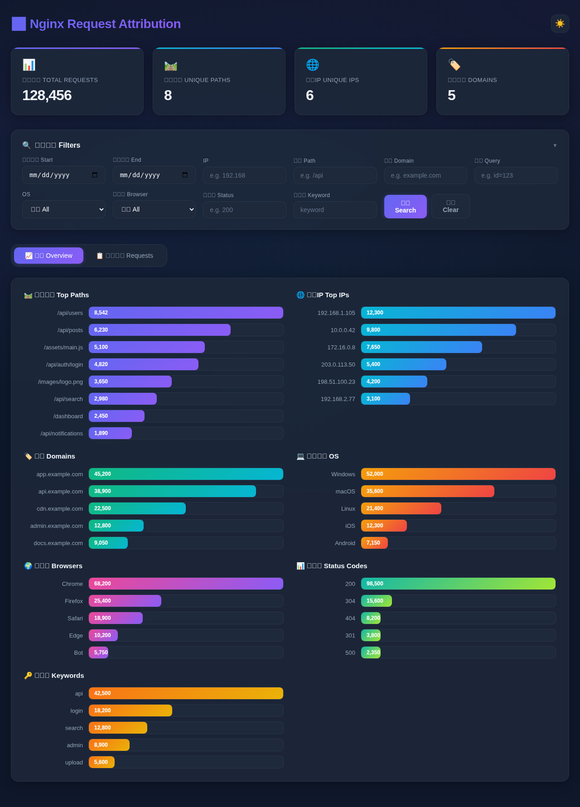
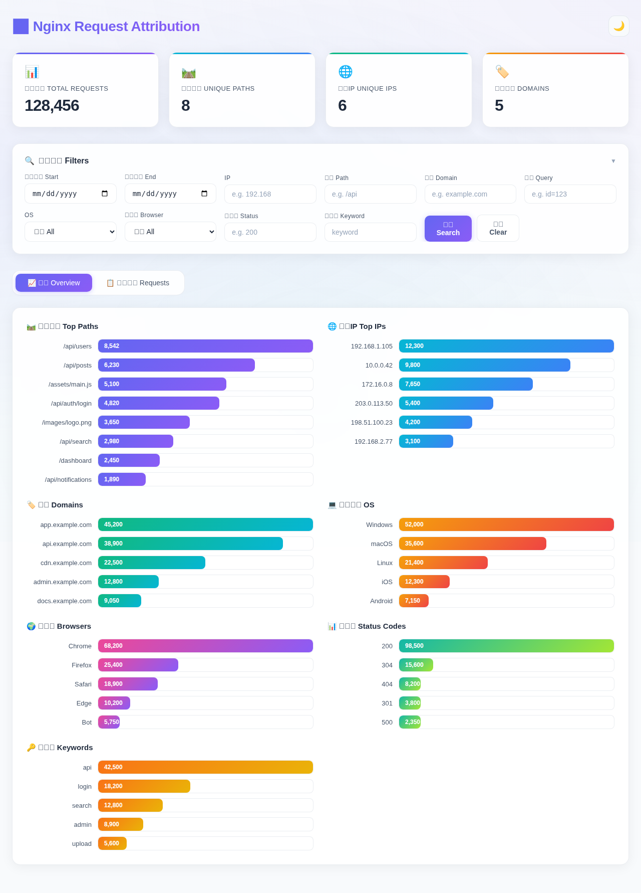

# Web Request Attribution

🌐 **English** | [繁體中文](README.zh-TW.md) | [简体中文](README.zh-CN.md) | [日本語](README.ja.md)

A lightweight web server (Nginx / Apache) access log analytics tool with statistics dashboard and real-time monitoring. Supports custom log formats.

## Screenshots

| Dark Mode | Light Mode |
|:-:|:-:|
|  |  |

## Features

- 🚀 **Single Binary** - Compiled with Go into a single executable, no additional runtime needed
- 📊 **Built-in Web GUI** - Statistics dashboard embedded in the binary, no separate frontend deployment required
- 🔍 **Multi-dimensional Filtering** - Filter by IP, path, domain, query parameters, OS, browser, status code, etc.
- 🔑 **Keyword Tracking** - Automatically track occurrences of configured keywords
- 📡 **Real-time Monitoring** - Automatically monitor new log file entries
- 🐳 **One-click Deploy** - Docker / Docker Compose deployment support
- 💾 **SQLite Storage** - Lightweight database, no external database service required
- 🌐 **Multilingual Interface** - Web GUI supports English, Traditional Chinese, and Japanese

## Quick Start

### Option 1: Download from Release

Download the prebuilt binary for your platform from the [latest GitHub Release](https://github.com/moehoshio/web-request-attribution/releases/latest):

| Platform | Asset |
|---|---|
| Linux x86_64 | `web-req-attr-linux-amd64` |
| Linux ARM64 | `web-req-attr-linux-arm64` |
| macOS Intel | `web-req-attr-darwin-amd64` |
| macOS Apple Silicon | `web-req-attr-darwin-arm64` |
| Windows x86_64 | `web-req-attr-windows-amd64.exe` |

```bash
# Linux/macOS example
chmod +x web-req-attr-linux-amd64
./web-req-attr-linux-amd64 -config config.json

# Import existing logs
./web-req-attr-linux-amd64 -import /var/log/nginx/access.log
```

### Option 2: Build from Source

```bash
go build -o web-req-attr ./cmd/
./web-req-attr -config config.json
```

### Option 3: Docker Deploy

```bash
# One-click start
docker-compose up -d

# Or manual Docker
docker build -t web-req-attr .
docker run -d \
  -p 8080:8080 \
  -v /var/log/nginx:/var/log/nginx:ro \
  -v ./data:/app/data \
  web-req-attr
```

## Configuration

All configuration is supplied via **`config.json`** and command-line
flags only — no environment variables are read. Running the binary in
a directory without a `config.json` will automatically create one with
safe defaults (no sources, watching disabled) so you can edit it from
the **Settings** tab in the UI without touching a terminal.

Until the first user account is created the dashboard runs in
**no-account mode**: anyone reaching the UI can administer the server.
Create your first user from the **Users** tab (or seed one via
`auth.bootstrap_admin`) to require login.

Example `config.json`:

```json
{
  "listen_addr": ":8080",
  "db_path": "./data/stats.db",
  "watch": true,
  "keywords": ["login", "admin", "api", "search"],
  "sources": [
    {
      "name": "nginx-main",
      "type": "file",
      "path": "/var/log/nginx/access.log",
      "read_compressed": false,
      "format": { "engine": "nginx", "preset": "combined" }
    }
  ],
  "auth": {
    "bootstrap_admin": {
      "username": "admin",
      "password": "change-me-on-first-login"
    },
    "session_ttl_hours": 24,
    "cookie_secure": false
  }
}
```

### Top-level fields

| Field | Description | Default |
|---|---|---|
| `listen_addr` | HTTP server listen address | `:8080` |
| `db_path` | SQLite database file path | `./data/stats.db` |
| `watch` | Enable real-time log monitoring | `false` |
| `keywords` | List of keywords to track | `[]` |
| `sources` | List of log sources to ingest from (see below) | `[]` |
| `auth` | Account-system settings (see [Authentication](#authentication)) | – |

### Authentication

The dashboard and `/api/*` endpoints are gated behind login. On first
launch, set `auth.bootstrap_admin` to seed the initial administrator
account; once `users` has at least one row, the bootstrap block is
ignored and can be removed. Sessions are HttpOnly cookies; non-GET API
calls also require the `X-CSRF-Token` header (the dashboard JS handles
this automatically via a double-submit cookie). Set `cookie_secure: true`
when serving over HTTPS. Additional accounts can be created from the
**Users** tab once you are signed in as an admin.

### Source fields

Each entry in `sources` describes one input. Common fields:

| Field | Description |
|---|---|
| `name` | Human-readable label (optional) |
| `type` | `file`, `dir`, or `syslog` |
| `format.engine` | `nginx`, `apache`, `custom`, or `auto` |
| `format.preset` | For `nginx`/`apache`: e.g. `combined`, `common`, `vhost_combined` |
| `format.pattern` | For `custom`: log pattern using Nginx-style `$variable` tokens |

File-source fields:

| Field | Description |
|---|---|
| `path` | Path to the live access log file |
| `read_compressed` | If `true`, also import sibling `*.gz` files once on startup |

Directory-source fields (`type: "dir"`):

| Field | Description |
|---|---|
| `path` | Directory to scan |
| `pattern` | Filename glob matched against the basename (e.g. `access*.log*`); empty matches every file |
| `recursive` | If `true`, descend into subdirectories |
| `read_compressed` | If `true`, also one-shot import any matching `*.gz` archives |

Directory sources resume safely across restarts: per-file ingestion
position (inode, offset, size, fingerprint) is tracked in the
`file_state` table, so rotation (rename + recreate or copytruncate) is
detected and never causes lines to be re-ingested or skipped. Plain
files are live-tailed; compressed archives that match the glob are
imported once when discovered and then ignored.

Syslog-source fields:

| Field | Description |
|---|---|
| `addr` | Listen address (e.g. `:1514`) |
| `proto` | `udp`, `tcp`, or `both` |

### Apache support

Apache logs are currently supported by **reading log files** (or receiving them
via syslog). Use `format.engine: "apache"` with one of the built-in presets
(`common`, `combined`, `vhost_combined`).

### Custom log format

Set `format.engine` to `"custom"` and provide a `pattern` using Nginx-style
`$variable` tokens, e.g.:

```json
"format": {
  "engine": "custom",
  "pattern": "$remote_addr - $remote_user [$time_local] \"$request\" $status $body_bytes_sent \"$http_referer\" \"$http_user_agent\""
}
```

Supported variables: `$remote_addr`, `$remote_user`, `$time_local`, `$msec`,
`$request`, `$request_method`, `$request_uri`, `$uri`, `$status`,
`$body_bytes_sent`, `$bytes_sent`, `$http_referer`, `$http_user_agent`,
`$http_host`, `$host`, `$server_name`, `$request_time`,
`$upstream_response_time`. Unknown variables are tolerated (matched and
discarded). See [`docs/custom-format-variables.md`](docs/custom-format-variables.md)
for the full reference. Apache `%`-style LogFormat tokens are not yet
supported — see [`docs/TODO.md`](docs/TODO.md).

### Compressed logs

Setting `read_compressed: true` on a file source imports rotated `.gz`
archives in the same directory once on startup. Support for `.bz2` and `.xz`
is tracked in [`docs/TODO.md`](docs/TODO.md).

#### Syslog Mode Configuration Example

Add to your Nginx configuration:
```nginx
access_log syslog:server=127.0.0.1:1514,facility=local7,tag=nginx combined;
```

## API Endpoints

### GET /api/stats

Get statistics summary. Supports the following query parameter filters:

| Parameter | Description |
|---|---|
| `start` | Start date (YYYY-MM-DD) |
| `end` | End date (YYYY-MM-DD) |
| `ip` | IP address (fuzzy search) |
| `path` | Path (fuzzy search) |
| `domain` | Domain (fuzzy search) |
| `query` | Query string (fuzzy search) |
| `method` | HTTP method |
| `status` | HTTP status code |
| `os` | Operating system |
| `browser` | Browser |
| `keyword` | Keyword |

**Response Example:**
```json
{
  "total_requests": 12345,
  "top_paths": [{"name": "/api/users", "count": 500}],
  "top_ips": [{"name": "192.168.1.1", "count": 300}],
  "top_domains": [{"name": "example.com", "count": 200}],
  "top_os": [{"name": "Windows", "count": 5000}],
  "top_browsers": [{"name": "Chrome", "count": 8000}],
  "top_keywords": [{"name": "api", "count": 1500}],
  "status_codes": [{"name": "200", "count": 10000}],
  "requests_per_day": [{"date": "2023-10-10", "count": 500}]
}
```

### GET /api/requests

Get request list (paginated). Additional parameters:

| Parameter | Description |
|---|---|
| `limit` | Results per page (default 100) |
| `offset` | Offset |

## Supported Log Formats

### Combined (Default)
```
$remote_addr - $remote_user [$time_local] "$request" $status $body_bytes_sent "$http_referer" "$http_user_agent"
```

### Virtual Host Combined
```
$host $remote_addr - $remote_user [$time_local] "$request" $status $body_bytes_sent "$http_referer" "$http_user_agent"
```

## Development

```bash
# Run tests
go test ./...

# Build
go build -o web-req-attr ./cmd/
```

For detailed development guidelines, testing requirements, and contribution workflow, see [CONTRIBUTING.md](CONTRIBUTING.md).

## License

MIT License
